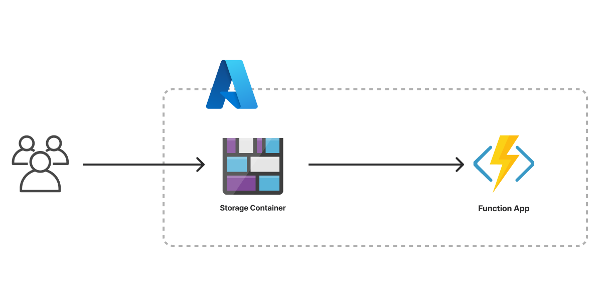

# Pulumi Policy as Code Demo with an Azure Serverless Application

## Overview
This repository contains a demonstration of how to use Pulumi for deploying a serverless application to Azure. The project includes Infrastructure as Code (IaC) and Policy as Code (PaC) components. It deploys the following resources:

- Azure Blob Storage Account: Configured for static website hosting.
- Azure Function: A serverless compute resource written in JavaScript.

Figure 1. Architecture of the Azure Serverless Application from the Pulumi website - https://www.pulumi.com/templates/serverless-application/azure/


## Prerequisites
Before you begin, ensure you have the following prerequisites in place:

- Pulumi CLI: Install the Pulumi CLI by following the instructions in the [official Pulumi documentation](https://www.pulumi.com/docs/install/).

- Azure Account: You'll need an Azure account and the Azure CLI installed. If you don't have one, you can [create a free account](https://azure.microsoft.com/en-us/free/) on the Azure portal.

- Programming Language: Familiarity with the programming language used for your Azure Function is helpful for code customization and understanding.

## Getting Started
Follow these steps to set up and deploy the serverless application:

1.  **Clone the repository**
    ```bash
    git clone https://github.com/AdoraNwodo/policy-as-code-demo.git
    cd policy-as-code-demo
    ```

2.  **Initialize Pulumi Project:**
    Initialize your Pulumi project by running:
    ```bash
    pulumi login
    pulumi stack init dev
    ```
    Configurations already exist in the `Pulumi.dev.yaml` file in this project so you don't need to do anything else.

3.  **Deploy Infrastructure:**
    Deploy the infrastructure using Pulumi by running:
    ```bash
    pulumi up
    ```
    Review the proposed changes and confirm the deployment.

4.  **Policy as Code (PaC):**
    This project includes Policy as Code (PaC) to enforce specific policies during deployment. Ensure that the policies align with your compliance requirements.

5.  **Access Your Serverless Application:**
    Once the deployment is complete, you can access your serverless application. The Blob Storage account hosts the static website, and the Azure Function provides dynamic functionality.

6.  **Clean up (optional)**
    To remove the resources and clean up the deployment, run:
    ```bash
    pulumi destroy
    ```
    Confirm the deletion of resources when prompted.

## Policy as Code (PaC)
This project demonstrates the use of Policy as Code (PaC) to enforce policies during infrastructure deployment. The policies are defined in the `policy` directory. Customize these policies according to your compliance requirements.

To associate and enforce policies during deployment, use the --policy-pack flag when running pulumi up. For example:

```bash
pulumi up --policy-pack policy/
```

## Contributing
Contributions to this project are welcome. Feel free to open issues, submit pull requests, or provide feedback to help improve this demo 💜

## License
This project is licensed under the MIT License - see the [LICENSE.md](LICENSE.md) file for details.